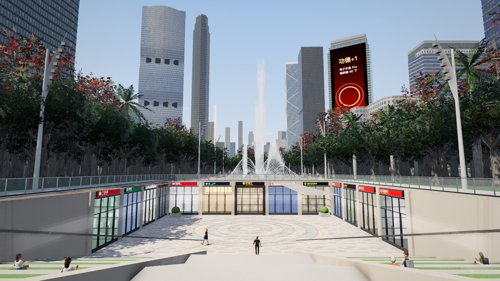
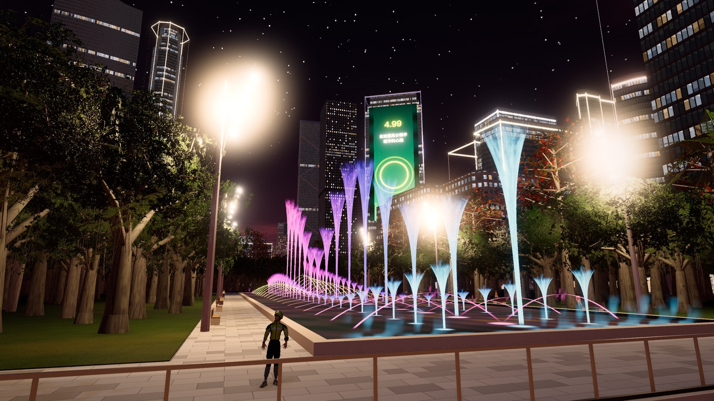

# 广州 · 天河 —— 近未来珠江新城网页 demo

在浏览器里跑的 GTA 式开放城市：真实的珠江新城路网和楼块（OpenStreetMap），2030 年代的媒体幕墙和雨夜，
主线是外卖骑手阿杰的《准时达》——平台 AI「小准」派单、算法压时限，黑色幽默。three.js + TypeScript，
城市和车辆在 Blender 里用 Python 程序化生成后导出 glTF。




## 试玩

到 [Releases](../../releases/latest) 下载最新的 `tianhe-demo_*.zip`，**整个解压**后：

- **Mac**：双击 `start-mac.command`（提示无法验证开发者：系统设置 → 隐私与安全性 → 仍要打开）
- **Windows**：双击 `start-windows.bat`（还没在 Windows 实机上测过，遇到问题请开 issue）
- 都不行：在 `game/` 里运行 `python -m http.server 4299`，浏览器打开 <http://127.0.0.1:4299/>

脚本只在本机 127.0.0.1 开一个静态服务器，不联网。不能直接双击 `index.html`（浏览器会拦截模型加载）。
推荐桌面版 Chrome / Edge、独立显卡或 M 系列 Mac；不支持手机。包里的 `README.txt` 有完整说明。

## 里面有什么

- **城市**：珠江新城核心区（北到黄埔大道、南到珠江对岸广州塔，西到广州大道、东到猎德大道），OSM 真实路网和楼块；
  西塔、东塔、广州塔、大剧院、省博、图书馆单独建模；昼夜循环、下雨、夜景灯光。
- **花城广场**：南段铺装大道和灯带、花城汇南区下沉广场、B1 中区长廊（直通 APM 花城大道站站厅）、
  北区下沉广场、音乐喷泉（夜里 19:30–22:30 有表演）、榕树林、广场舞。
- **电鸡**：阿杰的外卖电动车，两轮物理、压弯甩尾、摔车飞人、餐品完好度。
- **送外卖**：取餐、三种送达方式（当面交、保安和外卖柜、放门口拍照）、商家和顾客事件、评价与申诉；
  第一章《五星好评》6 个剧情单。
- **APM 线**：5 个真实地下站、隧道、列车，能进站刷卡坐车；43 个地铁出入口按 OSM 位置摆放。
- 开车、警察追逐、路人和车流；街坊讲粤语、平台讲普通话的全角色配音；车载电台（歌曲需自备，见下）。

## 操作

| 键 | 作用 |
| --- | --- |
| WASD / Shift / 空格 | 移动 / 冲刺 / 跳 |
| 鼠标 / 滚轮 | 转镜头 / 拉远拉近 |
| E | 说话、取餐、交餐、按门禁、刷卡进站（对话里 1 2 3 选回答） |
| F | 上下车（阿杰的电鸡停在出生点旁边） |
| 骑车 | W 加速 · S 刹车 / 倒退 · A/D 压弯 · 空格 后刹甩尾 · Q 喇叭 |
| 1 2 3 / Tab | 切换主角（阿杰 / 琪琪 / 强叔） |
| [ ] · R | 时间快进倒退 · 下雨 |
| M · N · B · P | 电台面板 · 下一首 · 上一首 · 暂停 |
| H · F3 | 说明 · 性能面板 |

## 开发

```bash
cd demo
npm install
npm run dev        # http://127.0.0.1:5288
```

- 打包试玩 zip：`bash demo/release_kit/make_release.sh` → `release/天河demo试玩_YYYYMMDD.zip`（release 目录不进版本库，成品放 GitHub Releases）。
- 回归测试：开发版页面控制台运行 `__GZ__.qa.run()`；建议 1280×720 窗口、按前缀分组跑（例如 `__GZ__.qa.run('VEH')`）。
- 路人 / 警察的决策默认用内置规则；设置环境变量 `TYPESAFE_API_KEY`（或 `~/.typesafe/key`）后，开发服务器会把 `/api/npc-brain` 转给 Jev 模型。密钥只在服务端读取。
- 电台歌曲是商业唱片，不在仓库里：把自己的音频放进 `music_in/`，运行 `python3 scripts/gz_music.py` 生成到 `demo/public/assets/music/`。

### 资产管线（Blender 5.1）

`demo/public/assets/` 里的 glb / json 都由 `scripts/` 生成，平时开发网页不需要 Blender。

```bash
python3 scripts/fetch_osm.py && python3 scripts/prepare_osm.py          # OSM → data/tianhe_core.json
Blender --background --python scripts/build_tianhe.py                   # → tianhe_core.blend
Blender --background tianhe_core.blend --python scripts/export_web.py -- demo/public/assets/tianhe
Blender --background --factory-startup --python scripts/gz_apm_build.py # APM 车站、隧道
```

脚本注释里的路径带 `guangzhou/` 前缀，因为项目原本在一个更大的仓库里。`scripts/gz_trees.py`（树和叶簇图集）
依赖原仓库 `lotus_pond/scripts/common.py`，这里没有带上；烘焙好的树资产已经在 `demo/public/assets/trees/`。

进度、已知问题和下一步都写在 [HANDOFF.md](HANDOFF.md)；设计文档在 `docs/`。

## 署名

- 地图数据 © [OpenStreetMap](https://www.openstreetmap.org/copyright) 贡献者，按 ODbL 授权。
- 地名是真实的，店名、品牌、广告和剧情人物都是虚构的。
- 三位主角由 [Tripo](https://www.tripo3d.ai/) 生成；配音由通义千问 qwen3-tts-flash 合成。
- 用到 [three.js](https://threejs.org/)（MIT）、[three-mesh-bvh](https://github.com/gkjohnson/three-mesh-bvh)（MIT）和 Draco 解码器（Apache-2.0）。
